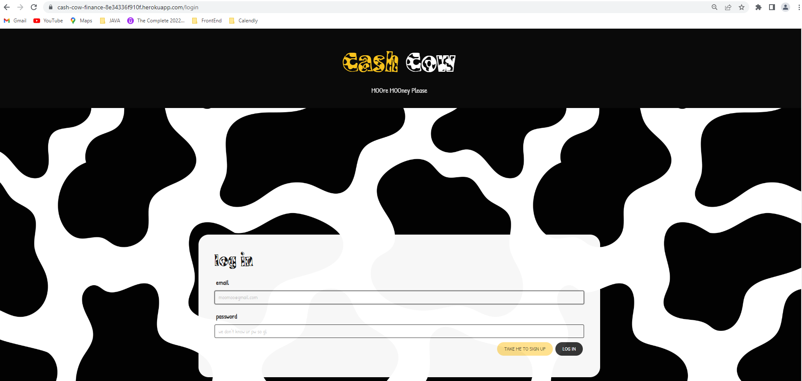
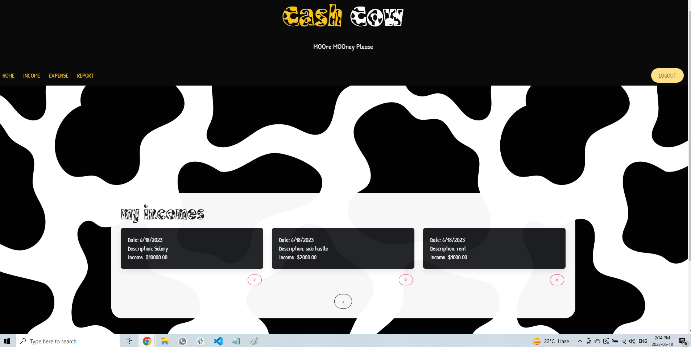
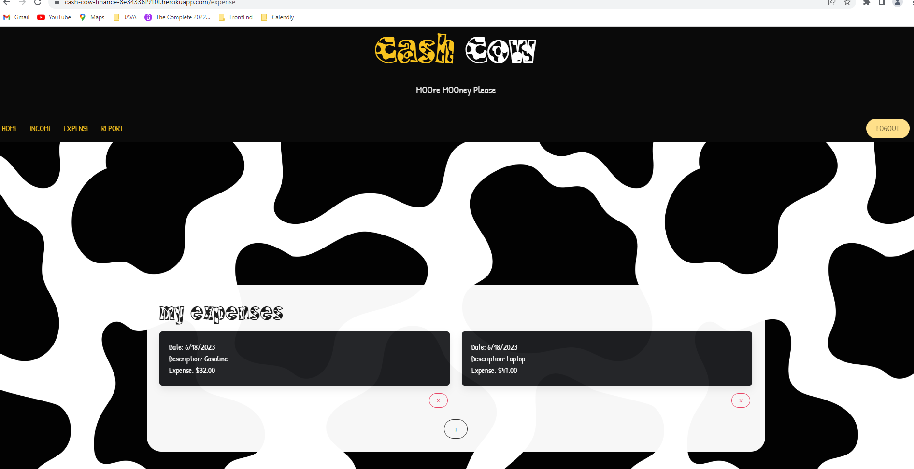
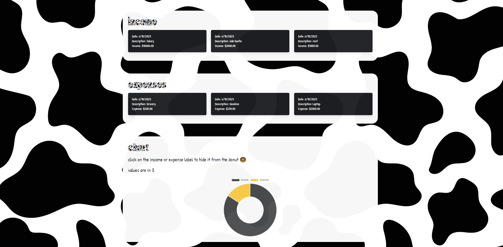

# Personal Finance Tracker: Cash Cow

 

## Description

The objective behind this application is to develop a web-based platform enbaling users to monitor their income, expenses, and budget. It aims to present visual representations and insights to help users manage their finances effectively.

 

## Table of Contents

- [Description](#description)
- [Table of Contents](#table-of-contents)
- [Demonstration](#demonstration)
- [Deployed Webpage](#deployed-webpage)
- [Technology](#technology)
- [Additional Features to Consider](#additional-features-to-consider)
- [Installation](#installation)
- [Credits](#credits)
- [License](#license)
- [Contributors](#contributors)

 

## Demonstration

Application Demonstration:\
Watch it on [Google Drive](https://drive.google.com/file/d/1hGhDxQ8W1MZIz4pS4DPlYim5_tXz3xx9/view).

Application Preview:\

### Login Page

### Income Page

### Expense Page

### Report Page

 

## Deployed Webpage

Click on the cow [🐮](https://cash-cow-finance-8e34336f910f.herokuapp.com/) to visit our site.

 

## Technology

The application utilizes a range of technogies to delivere its functionality. These include:

- Back-End Technologies:

  - Node.js: JavaScript runtime
  - Express: web application framework for Node.js

- Front-End Technologies:

  - Bulma: enehance the visual appearance and layout of the application
  - Animate.CSS: incorporate animations to the webpage

- Templating Engine:

  - Handlebars: generate dynamic HTML templates on the server-side

- Data Visualization

  - Chart.js: create chart for presenting financial data

- Database:

  - MySQL: handle and store data

- Object-Relational Mapping

  - Sequelize: interact with the MySQL database

- Environmental Variables:

  - Dotenv: access sensitve configuration variables

- Encryption:

  - Bcrypt: secure password hasing and encryption

- Deployment:
  - Heroku: host and deploy the application

 

## Additional Features to Consider

Here are some additional features to consider or implement in the future. These include:

1. Tags and Labels: Allow users to assign custom tags or labels to their expenses, making it easier to filter and search for specific transactions.
2. Bill Reminders: Send users notifications or reminders for upcoming bill payments to help them stay organized and avoid late fees.
3. Multiple Accounts: Support multiple accounts within the expense tracker, enabling users to track expenses separately for personal, business, or shared accounts.
4. Attachments: Enable users to attach files or images (e.g., receipts, invoices) to their expense entries for better record-keeping and reference.
5. Expense Notifications: Send users notifications or alerts when they exceed budget limits, encounter unusual spending patterns, or approach bill due dates.

 

## Installation

No installation prerequisites are necessary.

 

## Credits

To enhance the visual appeal of the webpage, the application integrates several external resources such as Bulma and Animate.css. Additionally, it utilizes a range of dependencies including Node.js, Express, Handlebars, chart.js, dotenv, sequelize, mysql, and bcrypt to effectively operate the server.

 

## License

Please refer to the [LICENSE](https://github.com/ronachen99/personal-finance-tracker/blob/main/LICENSE) document.

 

## Contributors

Rona C., Saveetha K., and Tyler V.
